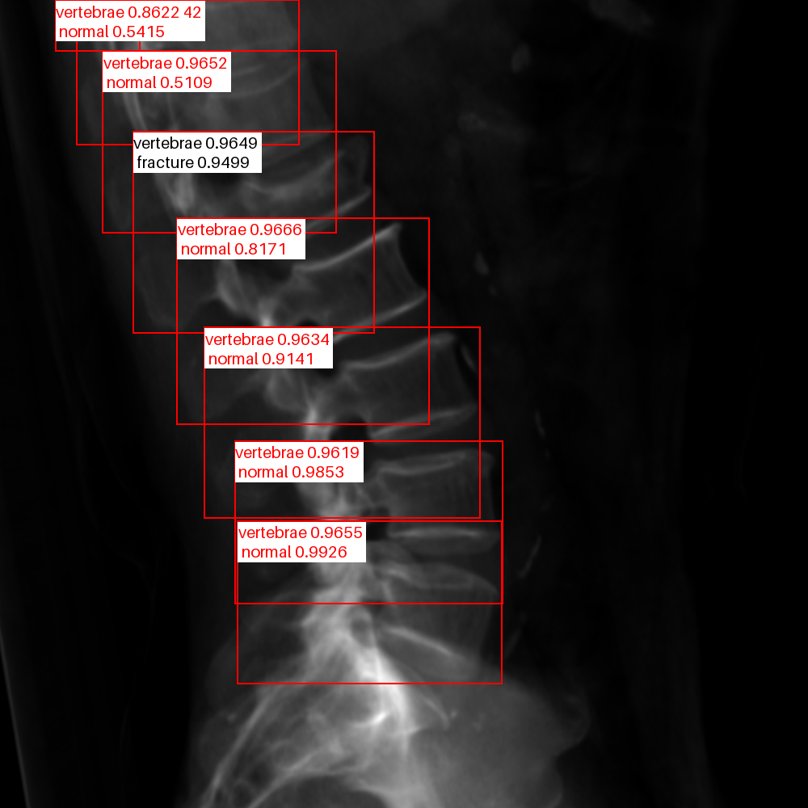
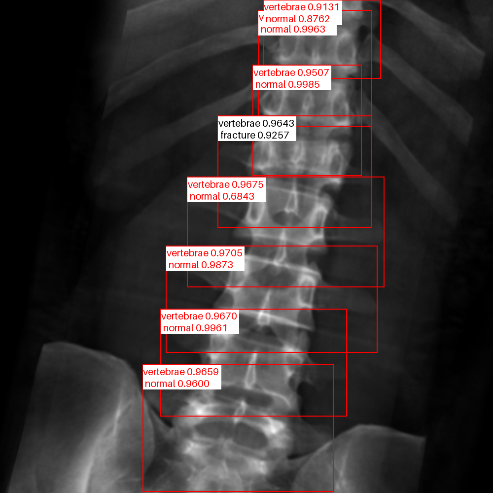
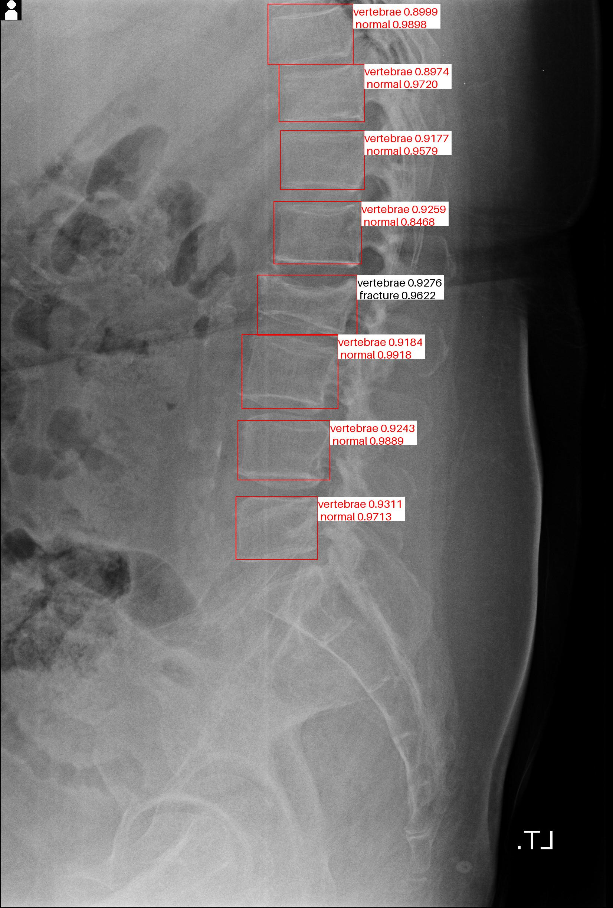

<!--
 * @Description: 
 * @version: 
 * @Author: ThreeStones1029 2320218115@qq.com
 * @Date: 2024-03-31 04:04:02
 * @LastEditors: ShuaiLei
 * @LastEditTime: 2024-07-02 01:00:56
-->
## Repository Notes
This article will be used to record fracture detection. The overall process will be to first detect and then classify the vertebral body in the detection box to determine whether it is fractured or not.
* [Original repository](https://github.com/WZMIAOMIAO/deep-learning-for-image-processing/tree/master/pytorch_classification/Test11_efficientnetV2)

## TODO
<details>
<summary> see details </summary>

- [x] Upload drr detection weights.
- [x] add yolov5 detection predict.
- [x] add detection training.

</details>

## Quick Start

<details>
<summary>Install</summary>

```bash
pip install -r requirements.txt
```
</details>

<details>
Well classified according to the category.
<summary>Data</summary>

```bash
.
├── cut_drr
│   ├── AP
│   │   ├── fracture_images
│   │   └── normal_images
│   ├── LA
│   │   ├── fracture_images
│   │   └── normal_images
│   ├── all
│   │   ├── fracture_images
│   │   └── normal_images
```
</details>

<details>
<summary>Training</summary>
[Note] the pretrain model can download from the Original repository.

```bash
python train.py
```
</details>

<details>
<summary>Predict</summary>

```bash
python predict.py
```
</details>

<details>
<summary>Eval</summary>

```bash
python eval.py
```
</details>


<details>
<summary>Detection classify</summary>
you can choose run rtdetr_paddle or rtdetr_pytorch

```bash
python detection classify.py
```
</details>


## Using examples
<div style="display: flex;">
    
    
</div>

<div style="display: flex;">
    
    
    
</div>
</details>
