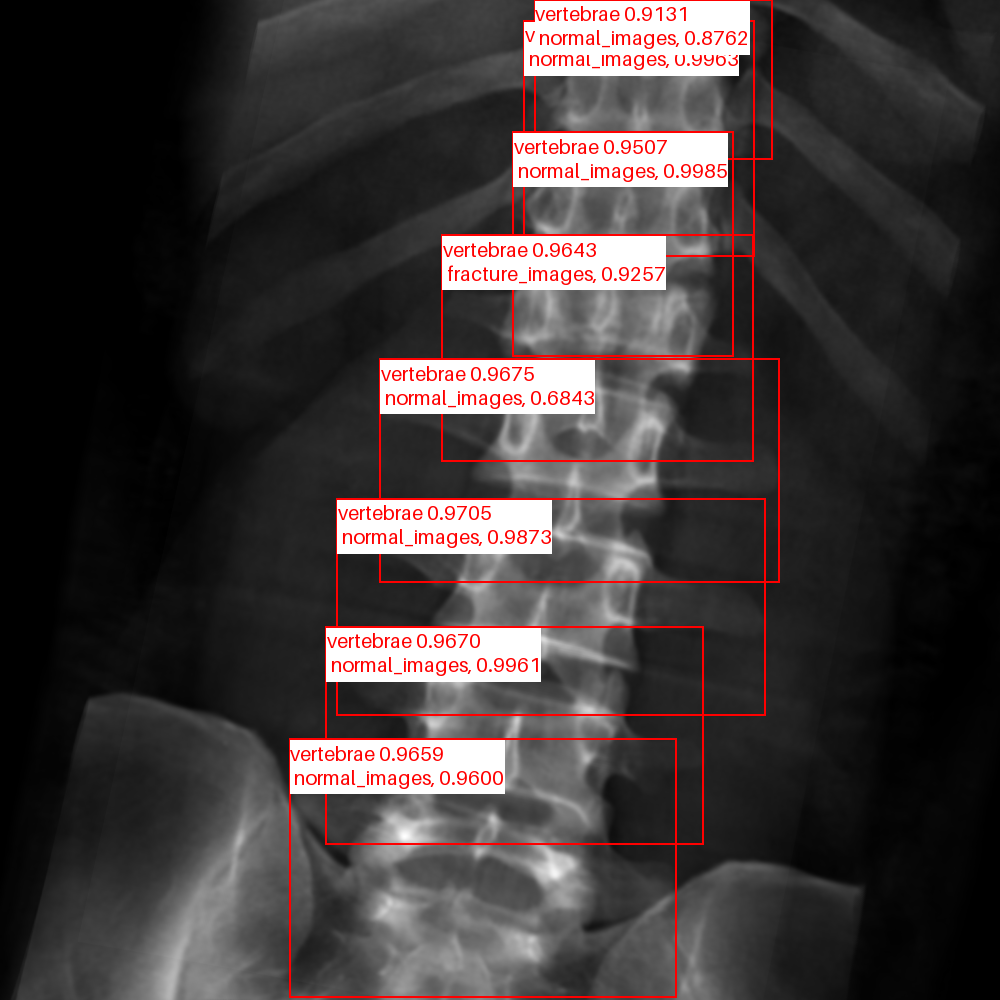
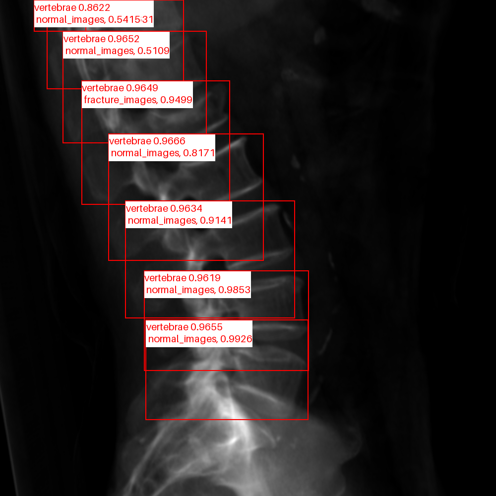

<!--
 * @Description: 
 * @version: 
 * @Author: ThreeStones1029 2320218115@qq.com
 * @Date: 2024-03-31 04:04:02
 * @LastEditors: ShuaiLei
 * @LastEditTime: 2024-04-19 01:06:11
-->
## Repository Notes
This article will be used to record fracture detection. The overall process will be to first detect and then classify the vertebral body in the detection box to determine whether it is fractured or not.
* [Original repository](https://github.com/WZMIAOMIAO/deep-learning-for-image-processing/tree/master/pytorch_classification/Test11_efficientnetV2)

## TODO
<details>
<summary> see details </summary>

- [x] Upload drr detection weights.
- [x] add yolov5 detection predict.
- [x] add detection training.

</details>

## Quick Start

<details>
<summary>Install</summary>

```bash
pip install -r requirements.txt
```
</details>

<details>
Well classified according to the category.
<summary>Data</summary>

```bash
.
├── cut_drr
│   ├── AP
│   │   ├── fracture_images
│   │   └── normal_images
│   ├── LA
│   │   ├── fracture_images
│   │   └── normal_images
│   ├── all
│   │   ├── fracture_images
│   │   └── normal_images
```
</details>

<details>
<summary>Training</summary>
[Note] the pretrain model can download from the Original repository.

```bash
python train.py
```
</details>


4. 在`train.py`脚本中将`--snapshot_epoch`参数设成为每次保存的权重epoch间隔
5. 在`train.py`脚本中将`--only_save_best_model`参数设成为是否只保存最好的模型
6. 在`train.py`脚本中将`--pretrain_weights`参数设成下载好的预训练权重路径
7. 在`train.py`脚本中将`--weights_category`参数设成[s, m, l]其中的一种,表示选用的预训练的模型类型
8. 在`train.py`脚本中将`--model_save_dir`参数表示模型保存路径
9. 设置好数据集的路径`--data-path`以及预训练权重的路径`--weights`就能使用`train.py`脚本开始训练了(训练过程中会自动生成`class_indices.json`文件)
10. 在`predict.py`脚本中导入和训练脚本中同样的模型，并将`model_weight_path`设置成训练好的模型权重路径(默认保存在weights文件夹下)
11. 在`predict.py`脚本中将`img_path`设置成你自己需要预测的图片绝对路径
12. 设置好权重路径`model_weight_path`和预测的图片路径`img_path`就能使用`predict.py`脚本进行预测了
13. 如果要使用自己的数据集，请按照花分类数据集的文件结构进行摆放(即一个类别对应一个文件夹)，并且将训练以及预测脚本中的`num_classes`设置成你自己数据的类别数

## 具体训练预测以及评估介绍(单击查看)
骨折预测
<div style="display: flex;">
    
    
</div>
</details>
